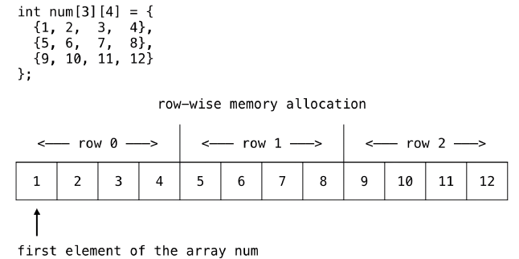

# MIPS & SPIM Assembler Cheat Sheet

## SPIM && MIPS Instructions 

### Bitwise Operations

| SPIM Instruction | MIPS Instruction | Example              | Notes                              |
| ---------------- | ---------------- | -------------------- | -----------------------------------|
| ADD Rd, Rs, Rt   | ADD Rd, Rs, Rt   | 


### Move && Load


| SPIM Instruction | MIPS Instruction | Example              | Notes/Description                                                                            |
| ---------------- | ---------------- | -------------------- | ---------------------------------------------------------------------------------------------|
| move Rd, Rs      |                  | move $s1, $v0        | 'Copy' the value stored in the register (memeory) on the right into the register on the left |
| mfhi Rd          | mfhi Rd          | mfhi $s1             |  Set a register equal to the high value in memory                                            |
| mflo Rd          | mflo Rd          | mflo $s1             |  Set a register equal to the low value in memeory                                            |
| la Rd, Addr      |                  | la $a0, prompt       |  Load an address into a register, could be a label or register                               |
| li Rd, imm       | lui	Rd, Imm   | li $v0, 4            |  Load a value immediately into a register, usable registers are 0..15, 16..31                |
| lb Rd, Addr      |                  | lb $s1, label        |  Load a byte at a particular mememory location                                               |
| lw Rd, Addr      |                  | lw $s1, x            |  Load a word at a particular mememory location                                               |
| sb Rs, Addr      |                  | sb $t1, y            |                                                                                              |


### Branches


## Theory

### Arrays 

#### 1D-Arrays

To access and manipulate array like structures in mips we treat the data we are accessing as a single block
of sequential memory addresses. If we want to jump to values stored at locations within this block we are
required to know the following:

+ Data in the block is of the same size in bytes, aka type
+ Data in the block is sequential and continuous
+ The index of the value we wish to access

With these components we can cast out accurately into the array in memory and manipulate and access the 
values stored there. 

For example to access the i-th element in an array of integers, or in SPIM/MIPS `words` we can compute the
address of the i-th element by multiplying i by the size in bytes of an integer (4), yeilding the expression:

`array_address[i] = i * 4`

We can then access the value stored at that memory location by loading the array in to a register and using 
the keyword associated with the array type to store or load a value. For example to read the i-th value in 
an array of integers, where i's value is stored in `$t0` we could use the following MIPS/SPIM code.

```
# retrive i-th array element value

mul $t1, $t0, 4			# store the address of the i-th array element    
la  $t2, int_array		# load the integer array into register t2    
add $t3, $t2, $t1		# cast out into the array to the i-th elements position    
lw  $t4, ($t3)			# load the value stored at int_array[i]'s position into register t4    
```  


#### 2D-Arrays

Similarly to one dimensional arrays two dimensional arrays should be consindered as sequential 
blocks of memory. Where each row of the matrix is stored one after another.



To access a given element in the array we require the following prerequisites:

+ Data in the block is of the same size in bytes, aka type
+ Data in the block is sequential and continuous
+ The x (or row) index 
+ The y (or column) index

We can then follow an extrapolated method from 1D arrays to get the [x][y]'th element from a 
2D array in mips. 

```
# $t0 holds x
# $t1 holds y

la  $t2, int_array
mul $t3, $t0, 36				# index y * (sizeof y * sizeof type (4))    
add $t4, $t3, $t2				# 
mul $t5, $t1, 4					# index x * sizeof type (4)    
add $t6, $t5, $t4				# 
lw  $t7, ($t6)					# load the value at int_array[x][y] into $t7    


# [2][9]
array:
    .word 9 4 3 2 5 1 1 4 3 1	# len(9)
    .word 7 3 9 6 6 2 4 8 6 8	# len(9)


```


### Functions


## Code Examples

### Basics

#### Read N Numbers

```
main:                       	# int main(void)
    la   $a0, prompt        	# printf("Enter a number: ");
    li   $v0, 4
    syscall

    li   $v0, 5             	# scanf("%d", number);
    syscall

    move $s1, $v0           	# move scan result into t1 reg

    li $t0, 1

counter:
    bgt	 $t0, $s1, end	    	# if $t0 > $t1 then end
    
    move $a0, $t0		    	# $a0 = $01
    li   $v0, 1             	# print syscall instruction
    syscall  

    li $a0, '\n'            	# add newline
    li $v0, 11              	# print syscall instruction 
    syscall

    addi $t0, $t0, 1			# $t0 = $t0 i++
    
    j counter               	# next iteration


end:
    li   $v0, 0
    jr   $ra                	# return

    .data
prompt:
    .asciiz "Enter a number: "	# ascii text

```

### Arrays

#### One Dimensional

##### Sort 10 Numbers

```
# i in register $t0,
# registers $t1 - $t3 used to hold temporary results

main:
    li   $s1, 0         			# i = 1
    li   $t0, 0         			# i = 0
loop0:
    bge  $t0, 10, end0  			# while (i < 10) {

    li   $v0, 5         			#   scanf("%d", &numbers[i]);
    syscall             			#

    mul  $t1, $t0, 4    			#   calculate &numbers[i]
    la   $t2, numbers   			#
    add  $t3, $t1, $t2  			#
    sw   $v0, ($t3)     			#   store entered number in array

    addi $t0, $t0, 1    			#   i++;
    j    loop0          			# }
end0:
    li   $t0, 0         			# i = 0
    addi $s1, $s1, 1    			# i += 1
    
    # branch to loop1 if greater i > 10

    bge	$s1, 10, loop1				# if $t1 > 10 then target
    

    # else -> 
    # store $t5 = numbers[i] = x

    mul $t1, $s1, 4             	# calculate i -> s1 (index counter) * sizeof(word) = numbers[i]
    la $t2, numbers 				# load the numbers array into t2
    add $t3, $t1, $t2				# get the memeory adress for the value at the calculated address -> numbers[i] 
    lw $t5, ($t3)       			# set register t5 to store the value at the memory address stored in reg t3

    # store $t6 = numbers[i - 1] = y

    sub	$t4, $t3, 4		        	# $t4 = $t3 - 4, calc i-1 address
    lw $t6, ($t4)					# store the value at the memory address stored in register t4

    # branch to end0 if x >= y
    bge	$t5, $t6, end0				# if $t0 >= $t1 then end

    # else ->
    # set numbers[i] = y $t4

    sw $t6, ($t3)                   # store the value in t6 into the value at t3
    sw $t5, ($t4)					# set numbers[i-1] = x, store the value in t5 into the location pointed to by t4
    
    # addi $t1, $t1, 1              # i++ 
    j end0
    
loop1:
    bge  $t0, 10, end1  			# while (i < 10) {

    mul  $t1, $t0, 4    			# calculate &numbers[i] -> index ($t0) * sizeof type (word = 4)
    la   $t2, numbers   			# load the numbers 'array' into 
    add  $t3, $t1, $t2  			# calculate the memory address of numbers[i]

    lw   $a0, ($t3)     			#   load numbers[i] into $a0
    li   $v0, 1         			#   printf("%d", numbers[i])
    syscall

    li   $a0, '\n'      			#   printf("%c", '\n');
    li   $v0, 11
    syscall

    addi $t0, $t0, 1    			#   i++
    j    loop1          			# }

end1:
    li   $v0, 0
    jr   $ra            			# return 0

.data

numbers:
    .word 0 0 0 0 0 0 0 0 0 0  		# int numbers[10] = {0};


```

#### Two Dimensional

##### Print Elements Of a 2D-Array

```

main:
    li   $s0, 0         # int i = 0;
loop1:
    bge  $s0, 3, end1   # if (i >= 3) goto end1;
    li   $s1, 0         #    int j = 0;
loop2:
    bge  $s1, 5, end2   #    if (j >= 5) goto end2;

    la   $t0, numbers   #        printf("%d", numbers[i][j]);
    mul  $t1, $s0, 20	#  array y size [5] * sizeof type (4)
    add  $t2, $t1, $t0  #  get the address of 
    mul  $t3, $s1, 4
    add  $t4, $t3, $t2
    lw   $a0, ($t4)
    li   $v0, 1
    syscall
    li   $a0, ' '      #       printf("%c", ' ');
    li   $v0, 11
    syscall
    addi $s1, $s1, 1   #       j++;
    j    loop2         #    goto loop2;
end2:
    li   $a0, '\n'     #    printf("%c", '\n');
    li   $v0, 11
    syscall

    addi $s0, $s0, 1   #   i++
    j    loop1         # goto loop1
end1:

    li   $v0, 0        # return 0
    jr   $ra

	.data
# int numbers[3][5] = {{3,9,27,81,243},{4,16,64,256,1024},{5,25,125,625,3125}};
numbers:
     .word  3, 9, 27, 81, 243, 4, 16, 64, 256, 1024, 5, 25, 125, 625, 3125


```


### Branching


### Functions

#### Recursive Factorials
```

main:
    addi $sp, $sp, -8  # create stack frame
    sw   $ra, 4($sp)   # save return address
    sw   $s0, 0($sp)   # save $s0

    li   $s0, 0
    la   $a0, msg1
    li   $v0, 4
    syscall            # printf(Enter n: ")

    li    $v0, 5
    syscall            # scanf("%d", &n)
    move  $s0, $v0

    move  $a0, $s0     # factorial(n)
    jal   factorial    #
    move  $t0, $v0     #

    move  $a0, $s0
    li    $v0, 1
    syscall            # printf ("%d", n)

    la    $a0, msg2
    li    $v0, 4
    syscall            # printf("! = ")

    move  $a0, $t0
    li    $v0, 1
    syscall            # printf ("%d", f)

    li   $a0, '\n'     # printf("%c", '\n');
    li   $v0, 11
    syscall

                       # clean up stack frame
    lw   $s0, 0($sp)   # restore $s0
    lw   $ra, 4($sp)   # restore $ra
    addi $sp, $sp, 8   # restore sp

    li  $v0, 0         # return 0
    jr  $ra

    .data
msg1:   .asciiz "Enter n: "
msg2:   .asciiz "! = "


    .text
factorial:

    addi $sp, $sp, -12  		# create stack frame  --> store 3, 4 byte quanties
    sw   $s2, 8($sp)    		# save n 			  --> $s2
    sw   $ra, 4($sp)   			# save return address --> main
    sw   $s1, 0($sp)   			# save $s1   		  --> result

    # $v0 returns the result

    # if n <= 1
    li $v0, 1                   # result  = 1
    beq	$a0, 1, return	        # if n <= 1 then return
    
    # else 

    move $s2, $a0           	# save n in $s2
    addi $a0, $a0, -1       	# n - 1 --> $a0 is a arg for func
    
    jal factorial           	# get n-1

    # n * factorial(n -1)
    mul $v0, $s2, $v0


return:

                       			# clean up stack frame
    lw   $s1, 0($sp)   			# restore $s0
    lw   $ra, 4($sp)   			# restore $ra
    lw   $s2, 8($sp)    		# restore n/$s2
    addi $sp, $sp, 12   		# restore sp
    
    jr $ra

```