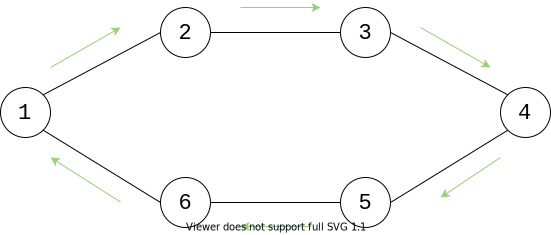

# Graph Basics

## Basic Terminology

+ Edges: A path or line which connects a pair of nodes
+ Node/Vertex: A point in the graph
+ Degree: The number of edges leaving a node

## Graph Types

+ Directed
+ Undirected

## Other Terms

### Subset

+ A samller set of nodes within the original (encompassing superset) graph 

### Cycle

+ A path through a graph which allows you to return to your starting place without revisting nodes/vertices (other than the source node)

+ This can be determined [algorithmically](./GraphCycles.md) 

### Clique

+  A subset of vertices is a clique if there is an edge between every pair of vertices in the subset (each node is connected to every other node)

+ This can be determined [algorithmically](./hasClique.c) 
    + *broken

### Hamiltonian Circuit

### Hamiltonian Path

### Euler path

### Euler Circuit