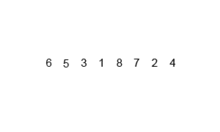

# Merge Sort

## Overview



Three Variants:

+ Top down
+ Bottom up
+ Natural

## Characteristics

+ Worst Case Time Complexity => O(n log n)
+ Gnerally not adaptive
+ Stable sort

## Pseudocode Implementation

```

func mergesort( var a as array )
     if ( n == 1 ) return a

     var l1 as array = a[0] ... a[n/2]
     var l2 as array = a[n/2+1] ... a[n]

     l1 = mergesort( l1 )
     l2 = mergesort( l2 )

     return merge( l1, l2 )
end func

func merge( var a as array, var b as array )
     var c as array

     while ( a and b have elements )
          if ( a[0] > b[0] )
               add b[0] to the end of c
               remove b[0] from b
          else
               add a[0] to the end of c
               remove a[0] from a
     while ( a has elements )
          add a[0] to the end of c
          remove a[0] from a
     while ( b has elements )
          add b[0] to the end of c
          remove b[0] from b
     return c
end func

```

## C Implementation

### Implementation One

```
void mergeSort(int A[], int lo, int hi) {
	if (lo >= hi) return;
	
	int mid = (lo + hi) / 2;
	mergeSort(A, lo, mid);
	mergeSort(A, mid + 1, hi);
	merge(A, lo, mid, hi);
}

void merge(int A[], int lo, int mid, int hi) {
	int nitems = hi - lo + 1;
	int *tmp = malloc(nitems * sizeof(int));
	
	int i = lo;
	int j = mid + 1;
	int k = 0;
	
	// scan both segments into tmp
	while (i <= mid && j <= hi) {
		if (A[i] <= A[j]) {
			tmp[k++] = A[i++];
		} else {
			tmp[k++] = A[j++];
		}
	}
	
	// copy items from unfinished segment
	while (i <= mid) tmp[k++] = A[i++];
	while (j <= hi)  tmp[k++] = A[j++];
	
	// copy items from tmp back to main array
	for (i = lo, k = 0; i <= hi; i++, k++) {
		A[i] = tmp[k];
	}
	free(tmp);

```

### Implementation Two

```

// Array A[] has the items to sort; array B[] is a work array.
void TopDownMergeSort(A[], B[], n)
{
    CopyArray(A, 0, n, B);           // one time copy of A[] to B[]
    TopDownSplitMerge(B, 0, n, A);   // sort data from B[] into A[]
}

// Sort the given run of array A[] using array B[] as a source.
// iBegin is inclusive; iEnd is exclusive (A[iEnd] is not in the set).
void TopDownSplitMerge(B[], iBegin, iEnd, A[])
{
    if(iEnd - iBegin <= 1)                       // if run size == 1
        return;                                 //   consider it sorted
    // split the run longer than 1 item into halves
    iMiddle = (iEnd + iBegin) / 2;              // iMiddle = mid point
    // recursively sort both runs from array A[] into B[]
    TopDownSplitMerge(A, iBegin,  iMiddle, B);  // sort the left  run
    TopDownSplitMerge(A, iMiddle,    iEnd, B);  // sort the right run
    // merge the resulting runs from array B[] into A[]
    TopDownMerge(B, iBegin, iMiddle, iEnd, A);
}

//  Left source half is A[ iBegin:iMiddle-1].
// Right source half is A[iMiddle:iEnd-1   ].
// Result is            B[ iBegin:iEnd-1   ].
void TopDownMerge(A[], iBegin, iMiddle, iEnd, B[])
{
    i = iBegin, j = iMiddle;
 
    // While there are elements in the left or right runs...
    for (k = iBegin; k < iEnd; k++) {
        // If left run head exists and is <= existing right run head.
        if (i < iMiddle && (j >= iEnd || A[i] <= A[j])) {
            B[k] = A[i];
            i = i + 1;
        } else {
            B[k] = A[j];
            j = j + 1;
        }
    }
}

void CopyArray(A[], iBegin, iEnd, B[])
{
    for(k = iBegin; k < iEnd; k++)
        B[k] = A[k];
}

```

