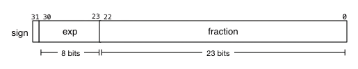

# Floating Point Numbers

Floating point numbers are a specific format, and standard, used to represent high precision decimal numbers. The bellow looks at 32 bit floating point numbers by way of example but 64 bit floats follow the same approach with larger segment sizes. 

## Components



The above depicts the three components or parts of a IEE Single precision 32 bit floating point number. 


| Component | length bits  | Purpose   
| --------- |--------------|--------------------------------------------------------- |
| sign      | 1            | Represents if the number is postive (0) or negative (1)  |
| exponent  | 8            | Represents the number preceeding the decimal point       |
| fraction  | 23           | Represents the decimal part of the number                |

## Working With Floats

Programatically floats can be broken into their components using bitshifting and bitmasking. Since the number of bits of each component is fixed and known we can create a mask of `sizeof (component)` and `&` the mask with shifted bit string to retrive the diffrent parts of a float.

The following C program demonstrates this.


```
// separate out the 3 components of a float
float_components_t float_bits(uint32_t f) {

    float_components_t components;
    
    uint32_t sign_mask = 1;
    uint32_t exponent_mask = 255;
    uint32_t fraction_mask = 0x7fffff;

    components.sign = sign_mask & (f >> 31);
    
    components.exponent = exponent_mask & (f >> 23);
    
    components.fraction = fraction_mask & f;

    return components;
}
```