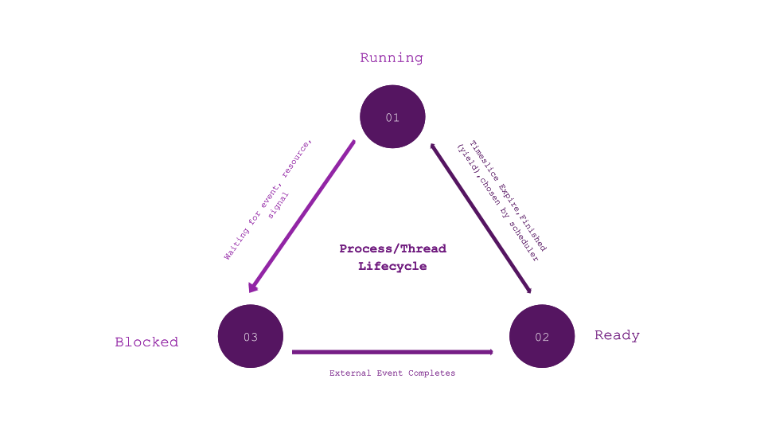

# Processes and Threads


## Overview

* Processes and threads are used to support the fundemental roles of an operating system
    
    - Providing interprocess communication
    - Issuing resources to processes
    - Maximise performance and processor usage

► [Overview](#Overview)   
► [Processes](#Processes)   
► [Threads](#Threads)   
► [Process/Thread Lifecycle](#Process/Thread%20Lifecycle)    
► [Ready Queues](#Ready%20Queues)    
► [Finite State Machines](#Finite%20State%20Machines)


## Processes

* An individual program which owns the resources allocated for its execution
* The processes is all the artifacts of the program both pre, during and post execution
* This includes any threads associated with the programs execution
* File descriptors
* Memory Regions

The proc file on UNIX like systems contains the following process artifacts:

```
.
├── arch_status
├── attr
├── autogroup
├── auxv
├── cgroup
├── clear_refs
├── cmdline
├── comm
├── coredump_filter
├── cpuset
├── cwd -> /
├── environ
├── exe -> /
├── fd
├── fdinfo
├── gid_map
├── io
├── limits
├── loginuid
├── map_files
├── maps
├── mem
├── mountinfo
├── mounts
├── mountstats
├── net
├── ns
├── numa_maps
├── oom_adj
├── oom_score
├── oom_score_adj
├── pagemap
├── patch_state
├── personality
├── projid_map
├── root -> /
├── sched
├── schedstat
├── sessionid
├── setgroups
├── smaps
├── smaps_rollup
├── stack
├── stat
├── statm
├── status
├── syscall
├── task
├── timers
├── timerslack_ns
├── uid_map
└── wchan

```


## Threads

* Can be thought of as a unit of execution
* Belongs to a parent process
* Reclaimed by operating system
* Common source of concurrency challenges
* Easier to program than a state machine

### Thread Model

* Local variables are per-thread and stored on the processes stack
* Global variables shared between all threads
* Can dynamically allocate memeory either globally or locally

## Process/Thread Lifecycle

* Processes exist in 3 states
    
    - **Ready**
    - **Running**
    - **Blocked**

* The state that a process exists in is generally out of its control to some extent and is influenced by events 'external' to it



### Transition Events

#### Ready 🠒 Running

* The process is chosen by the scheduler

#### Running 🠒 Blocked

* Waiting for input
* Waiting for I/O to complete
* Waiting for signal
* Waiting for a resource
* Waiting for network 

#### Blocked 🠒 Ready 

* External event completes

    - File read finishes
    - Packet arrives

* Another unblocking event occurs

## Ready Queues

* The queue which stores processes waiting to be chosen by the scheduler
* Typically the OS will also utilise a Blocked Queue to store processors waiting to unblock
* In modern operating systems there will be many queues
* This is because groups of processors will become blocked for diffrent reasons so it is inefficent to store all blocked processes in the same queue


## Finite State Machines

* Also known as an event based model
* Events are seperated into three broad categories
* **Input Events**
    -  Events that trigger a response from the system
* **Non-Blocking Events**
    - Events that we can trigger to run in the background (Non-Blocking actions)
* **External Events**
    
    - Events out of the systems control/managment 
* Handled by a centralised scheduler

    - Quite complex to program/manage scheduling effectively